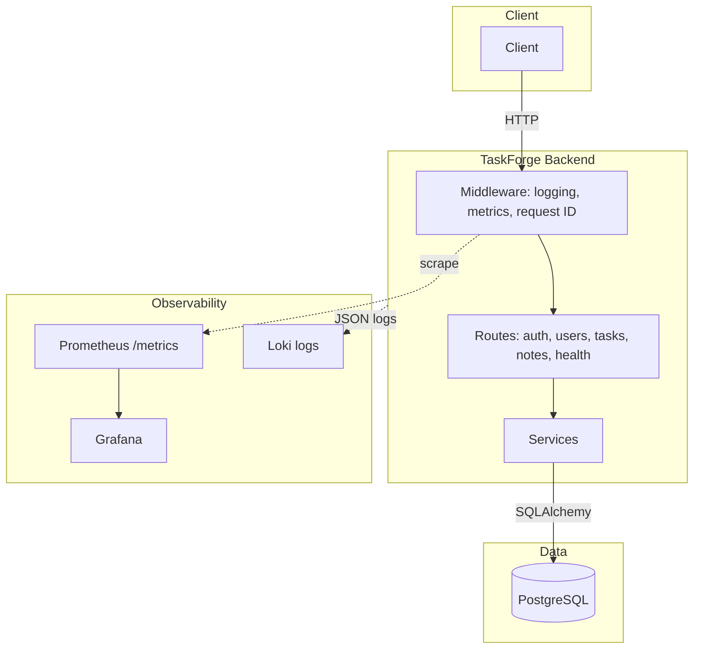

# TaskForge Backend

[](https://github.com/LongTheta/taskforge-backend/actions/workflows/ci.yml)
[](https://www.python.org/downloads/)
[](https://fastapi.tiangolo.com/)
[](LICENSE)

**TaskForge** is a task and notes management platform — users can register, log in, create tasks with status/priority, and organize notes. This repo is the backend API for TaskForge.

A production-style FastAPI service with JWT auth, designed as a reference for platform engineering, DevSecOps, observability, and GitOps demos.

---

## 1. Overview

**What it does:** Provides a REST API for user registration, login, task CRUD, and note CRUD. All data is user-scoped. Authentication uses JWT access tokens.

**Why it exists:** To serve as a clean, portfolio-friendly reference backend that demonstrates practical platform engineering patterns: centralized config, structured logging, Prometheus metrics, health probes, security scanning, and GitOps-ready deployment metadata.

**Who it's for:** Engineers learning FastAPI, platform/DevSecOps practitioners building demos, and teams needing a lightweight reference backend for tasks and notes.

---

## 2. Features

| Feature | Status |
|---------|--------|
| JWT auth (register, login) | ✅ |
| Task CRUD + status/priority filters | ✅ |
| Note CRUD | ✅ |
| PostgreSQL + Alembic migrations | ✅ |
| Health / readiness probes | ✅ |
| OpenAPI docs (`/docs`, `/redoc`) | ✅ |
| Structured logging + request IDs | ✅ |
| Prometheus metrics (`/metrics`) | ✅ |
| Docker (dev + prod targets) | ✅ |
| Docker Compose (local stack) | ✅ |
| GitHub Actions CI (lint, test, security, SBOM, Docker) | ✅ |
| Pinned workflow actions (full SHA) | ✅ |
| SBOM generation (CycloneDX) | ✅ |
| Production secret validation | ✅ |
| GitOps deployment metadata | ✅ |
| Manual promotion gate (placeholder) | ✅ |
| Build provenance attestation (SLSA-style) | ✅ |
| Kustomize base + overlays (dev/prod) | ✅ |
| ArgoCD Application (dev + prod) | ✅ |
| NetworkPolicy (workload isolation) | ✅ |
| External Secrets example | ✅ |
| Grafana dashboard + Prometheus config | ✅ |
| Deployment metadata (/info, build_info metric) | ✅ |
| Rate limiting (login, API) | ✅ |
| Audit logging (auth, task, note actions) | ✅ |
| Refresh tokens | ✅ |
| Basic RBAC (user, admin roles) | ✅ |

---

## 3. Architecture Overview



**App:** FastAPI with JWT auth, task/note CRUD, health probes, Prometheus metrics, structured JSON logging.

**CI/CD:** GitHub Actions — lint, test, security (Bandit, pip-audit), SBOM (CycloneDX), Docker build with SHA tag, build provenance attestation, manual promotion gate.

**GitOps:** Kustomize base + overlays (dev/prod); ArgoCD syncs on commit. Immutable image tags.

**Observability:** `/metrics` (Prometheus), `/health`/`/info` (metadata), JSON logs (Loki-ready). Grafana dashboard for request rate, latency, error rate, health status.

- **FastAPI app** — `app/main.py` wires routes, middleware, and exception handling.
- **API routes** — Thin handlers in `app/api/routes/`; auth, users, tasks, notes, health.
- **Service layer** — Business logic in `app/services/`; reusable across routes.
- **DB layer** — SQLAlchemy 2.x models, Alembic migrations, session via dependency.
- **Config** — Single source in `app/core/config.py`; env-driven, production validation.

---

## 4. Repo Structure

```
taskforge-backend/
├── app/
│   ├── main.py           # FastAPI app, middleware, exception handler
│   ├── core/             # Config, security, database, logging, metrics
│   ├── api/              # Routes, deps (auth, DB session)
│   ├── models/           # SQLAlchemy models
│   ├── schemas/          # Pydantic request/response schemas
│   ├── services/         # Business logic
│   └── db/               # Base, mixins
├── alembic/              # Migrations
├── deploy/               # GitOps manifests
│   ├── kustomize/        # base + overlays (dev, prod), NetworkPolicy
│   ├── argocd/           # ArgoCD Applications (dev + prod)
│   ├── external-secrets/ # Production secret injection example
│   └── SECRETS.md, GITOPS.md
├── docs/                 # DATA-PROTECTION.md, MFA-DESIGN.md
├── observability/        # Grafana, Prometheus, Loki, alert rules
├── tests/
├── .github/workflows/    # CI
├── Dockerfile            # dev + prod targets
├── docker-compose.yml
└── pyproject.toml
```

---

## 5. Local Development

### Prerequisites

- Python 3.11+
- PostgreSQL (or Docker Compose for DB)

### Setup

```bash
cd taskforge-backend
pip install -e ".[dev]"
cp .env.example .env
# Edit .env: DATABASE_URL, SECRET_KEY (use any value for local dev)
alembic upgrade head
```

### Run

```bash
uvicorn app.main:app --reload --port 8000
```

- **API:** http://localhost:8000  
- **Docs:** http://localhost:8000/docs  
- **Metrics:** http://localhost:8000/metrics  

**Windows:** Use `.\scripts\format.ps1` or `.\scripts\format.bat` (no `make` required).

---

## 6. Docker Usage

### Local dev (DB only)

```bash
docker compose up -d db
alembic upgrade head
uvicorn app.main:app --reload --port 8000
```

### Full stack

```bash
docker compose up --build
```

### Production image

```bash
docker build --target prod -t taskforge-backend:0.1.0 .
docker run -e DATABASE_URL=... -e SECRET_KEY=... -e APP_ENV=production -p 8000:8000 taskforge-backend:0.1.0
```

Use version or commit SHA for tags; avoid `latest`.

---

## 7. Testing and Quality Checks

| Check | Command |
|-------|---------|
| Lint | `ruff check app tests` |
| Format | `ruff format app tests` |
| Fix | `ruff check app tests --fix` then `ruff format app tests` |
| Tests | `pytest tests/ -v` |
| Security | `bandit -r app -c pyproject.toml` |
| Dependencies | `pip-audit --skip-editable --ignore-vuln CVE-2024-23342` |

Tests use SQLite. `conftest.py` sets `DATABASE_URL`, `SECRET_KEY`, `APP_ENV`.

---

## 8. Environment Variables

| Variable | Required | Description |
|----------|----------|-------------|
| `APP_ENV` | No | `development` \| `production` \| `test`. Default: development |
| `DATABASE_URL` | Yes (prod) | PostgreSQL connection string |
| `SECRET_KEY` | Yes (prod) | JWT signing key. Generate: `openssl rand -hex 32` |
| `JWT_ALGORITHM` | No | Default: HS256 |
| `ACCESS_TOKEN_EXPIRE_MINUTES` | No | Default: 30 |
| `REFRESH_TOKEN_EXPIRE_DAYS` | No | Default: 7 |
| `RATE_LIMIT_ENABLED` | No | Default: true. Set false to disable (e.g. tests) |
| `RATE_LIMIT_LOGIN_PER_MINUTE` | No | Default: 5 |
| `RATE_LIMIT_API_PER_MINUTE` | No | Default: 100 |
| `DEBUG` | No | Default: false |
| `LOG_LEVEL` | No | Default: INFO |
| `APP_VERSION` | No | Version override (CI injects from build) |
| `GIT_SHA` | No | Build metadata (set by CI) |
| `IMAGE_TAG` | No | Image tag (set by CI) |

**Local:** `APP_ENV=development`; `DATABASE_URL` defaults to local PostgreSQL; `SECRET_KEY` can be any value (validation only applies in production).

**Production:** Set `APP_ENV=production`, `DATABASE_URL`, and a secure `SECRET_KEY`. Startup fails if `SECRET_KEY` matches a known insecure value.

---

## 9. Security Notes

- **Passwords:** bcrypt hashing, min 8 chars on registration.
- **JWT:** HS256, configurable expiry. Set `SECRET_KEY` via env in production.
- **Secrets:** Never commit `.env`. In production, startup fails if `SECRET_KEY` is a known insecure value.
- **API:** No stack traces to clients. Task/note access is user-scoped.
- **CI:** Bandit (static analysis), pip-audit (dependency vulnerabilities).
- **Supply chain:** Actions pinned by SHA; SBOM generated; Docker image tagged by commit SHA; build provenance attestation for SBOM and build-metadata artifacts.

### Security Enhancements

These controls address production-readiness gaps identified in security evaluations:

| Control | Purpose |
|---------|---------|
| **Rate limiting** | Prevents brute-force login and API abuse. Login: 5/min per IP; API: 100/min per user or IP. Configure via `RATE_LIMIT_*` env vars. |
| **Audit logging** | Tracks security-relevant actions (login success/failure, registration, task/note CRUD) with `event_type: audit` in structured logs. Includes user_id, action, resource_id, request_id. No passwords or tokens logged. |
| **Refresh tokens** | Long-lived JWT for token refresh. Use `POST /api/v1/auth/refresh` with `{"refresh_token": "..."}` to get new access and refresh tokens. |
| **RBAC / roles** | User model has `role` (default: `user`). Admin-only routes use `require_role("admin")`. Example: `GET /api/v1/admin/stats`. Create admin via DB: `UPDATE users SET role='admin' WHERE email='...'`. |

**Known limitations:** MFA not implemented (design in `docs/MFA-DESIGN.md`). Container image signing deferred. See Roadmap.

---

## 10. Observability

| Feature | Implementation |
|---------|----------------|
| **Health** | `/health` — status, version, env, optional git_sha, image_tag |
| **Info** | `/info` — same as health (deployment metadata) |
| **Readiness** | `/ready` — DB connectivity check |
| **Metrics** | `/metrics` — Prometheus: `http_requests_total`, `http_request_duration_seconds`, `http_requests_in_progress`, `taskforge_build_info` |
| **Structured logging** | JSON in prod with service, version, env for Loki correlation |
| **Request IDs** | `X-Request-ID` in request/response; accepts client value or generates one |
| **Error visibility** | Unhandled exceptions logged; clients receive generic 500 |

**Grafana/Prometheus/Loki:** See `observability/README.md`. Import `observability/grafana/taskforge-overview.json` for dashboards. `observability/loki-labeling-guidance.md` for LogQL and label guidance.

**Alerting:** `observability/prometheus-alerts.example.yml` — TaskForgeDown, HighErrorRate, HighLatency.

**Audit logs → SIEM:** Filter by `event_type: audit`. See `observability/README.md` for Loki/SIEM routing.

---

## 11. GitOps Readiness

### Kustomize Structure

```
deploy/kustomize/
├── base/           # Deployment, Service, ConfigMap, Secret, NetworkPolicy
└── overlays/
    ├── dev/        # kustomization.yaml, patch.yaml (environment=dev)
    └── prod/       # kustomization.yaml, patch.yaml (environment=prod)
```

Apply: `kubectl apply -k deploy/kustomize/overlays/dev` (or `prod`).

### Secrets (Production)

**Base secret is for local/dev only.** Production must use External Secrets Operator or equivalent. See `deploy/SECRETS.md` and `deploy/external-secrets/`.

### NetworkPolicy

Base includes a NetworkPolicy for workload isolation (ingress on 8000, egress to DNS and PostgreSQL). Tighten for production per `deploy/kustomize/base/network-policy.yaml` comments.

### ArgoCD Usage Pattern

- **Dev:** `deploy/argocd/application.yaml` — automated sync.
- **Prod:** `deploy/argocd/application-prod.yaml` — manual sync. See `deploy/GITOPS.md`.

### Image Tagging Strategy

CI builds with commit SHA (e.g. `abc1234`). Use immutable tags only; avoid `latest`. Update overlay `images[].newTag` in `kustomization.yaml` when promoting. For releases, use semantic version (e.g. `0.1.0`).

### Environment Promotion Model

Same image tag flows dev → stage → prod. Overlays differ by namespace, replicas, and LOG_LEVEL. Configure `production` environment in GitHub for manual approval before prod deploy.

### Deployment Metadata

`APP_ENV`, `APP_VERSION`, `GIT_SHA`, `IMAGE_TAG` in ConfigMap/env; exposed in `/health`, `/info`, `taskforge_build_info` metric.

---

## 12. CI/CD Overview

GitHub Actions runs on push/PR to `main`:

| Job | Purpose |
|-----|---------|
| **lint** | Ruff check + format; fails if code needs formatting |
| **test** | pytest with SQLite |
| **security** | Bandit, pip-audit |
| **sbom** | CycloneDX SBOM (JSON); uploaded as artifact |
| **docker** | Build prod image; tag with commit SHA; build metadata artifact |
| **promote** | Manual gate (runs on push to main or workflow_dispatch); requires `production` environment approval |

**Supply chain:** All actions pinned by full 40-char SHA. Docker base image pinned. SBOM generated for Python deps. Build provenance attestation for SBOM and build-metadata (SLSA-style, signed via Sigstore; verify with `gh attestation verify`).

**Promotion gate:** Configure `production` environment in repo Settings → Environments with required reviewers. The promote job blocks until approved.

**Artifact traceability:** `build-metadata` artifact contains `git_sha`, `image_tag`, `version`. Use `GIT_SHA` and `IMAGE_TAG` env vars at deploy time.

---

## 13. API Routes

| Method | Endpoint | Description |
|--------|----------|-------------|
| POST | `/api/v1/auth/register` | Register user |
| POST | `/api/v1/auth/login` | Login, get JWT + refresh token |
| POST | `/api/v1/auth/refresh` | Exchange refresh token for new tokens |
| GET | `/api/v1/users/me` | Current user (auth) |
| GET | `/api/v1/admin/stats` | Admin-only: user/task/note counts |
| POST | `/api/v1/tasks` | Create task |
| GET | `/api/v1/tasks` | List tasks (`?status=`, `?priority=`) |
| GET | `/api/v1/tasks/{id}` | Get task |
| PATCH | `/api/v1/tasks/{id}` | Update task |
| DELETE | `/api/v1/tasks/{id}` | Delete task |
| POST | `/api/v1/notes` | Create note |
| GET | `/api/v1/notes` | List notes |
| GET | `/api/v1/notes/{id}` | Get note |
| PATCH | `/api/v1/notes/{id}` | Update note |
| DELETE | `/api/v1/notes/{id}` | Delete note |
| GET | `/health` | Liveness |
| GET | `/info` | Deployment metadata (version, env, git_sha, image_tag) |
| GET | `/ready` | Readiness |
| GET | `/metrics` | Prometheus metrics |

---

## 14. Releases and Versioning

**Current version:** `0.1.0` (see `pyproject.toml`, `app/core/config.py`).

**Semantic versioning:** We use [SemVer](https://semver.org/) — `MAJOR.MINOR.PATCH`. Breaking API changes bump MAJOR; new features bump MINOR; fixes bump PATCH.

**Creating a release:**
1. Update version in `pyproject.toml` and `app/core/config.py` (APP_VERSION).
2. Create a git tag: `git tag v0.1.0`
3. Push tag: `git push origin v0.1.0`
4. Create a GitHub Release from the tag with release notes.

**Image tagging:** For releases, use the version (e.g. `taskforge-backend:0.1.0`). For CI builds, use commit SHA (e.g. `taskforge-backend:abc1234`).

---

## 15. Roadmap

**Planned next:**

- [ ] MFA for admin (design in `docs/MFA-DESIGN.md`)
- [ ] Audit logging retention / export
- [ ] Image publish to registry (ghcr.io, ECR)
- [ ] ArgoCD Image Updater or CI-driven overlay updates

**Later:**

- [ ] OpenTelemetry tracing
- [ ] CodeQL, Trivy container scanning
- [ ] Container image attestation (requires registry push)
- [ ] cosign/signing for critical artifacts (optional hardening)
- [ ] Helm chart (if Kustomize complexity grows)

---

## Tech Stack

| Layer | Technology |
|-------|------------|
| Framework | FastAPI |
| ORM | SQLAlchemy 2.x |
| Migrations | Alembic |
| Database | PostgreSQL |
| Auth | JWT (PyJWT), bcrypt |
| Validation | Pydantic v2 |
| Metrics | prometheus_client |
| Testing | pytest, FastAPI TestClient |
| Lint | Ruff |
| Security | Bandit, pip-audit |

---

## License

MIT — see [LICENSE](LICENSE).
